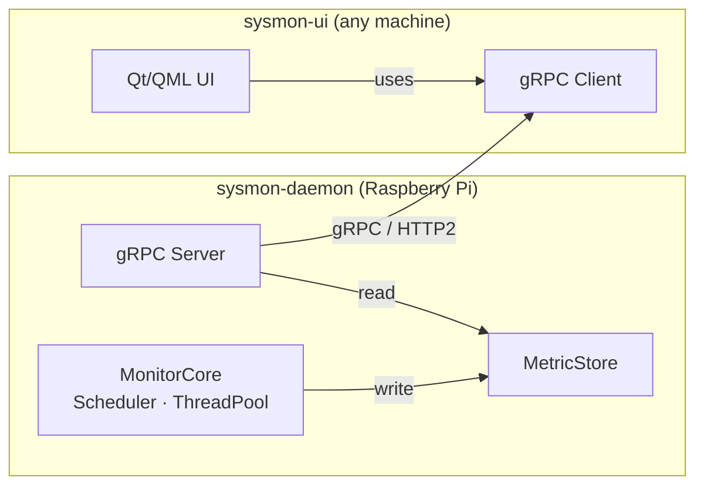

# SysMon - A Linux System Monitor


**SysMon** is a modern C++20 Linux system monitoring application. It demonstrates systems programming by building a reusable C++20 concurrency library, modular software architecture and infrastructure oriented design. The target for this project is Raspberry Pi via a Yocto-built embedded Linux image.

## Features

- **Runtime Library**
  - Reusable C++20 thread pool and one-shot periodic task scheduler
  - `std::jthread`-based workers with cooperative shutdown via `std::stop_token`
  - Thread-safe work queue with task submission
  - Google Benchmark suite
- **System Monitoring**
  - CPU, memory and process metrics via `/proc` and `/sys` readers
  - Snapshot based data model
- **Communication**
  - gRPC streaming API with live metric delivery over HTTP/2 + Google Protobuf
  - Independent daemon and UI - The UI can connect locally or remotely
- **User Interface**
  - Qt / QML UI for real-time charts and process table
  - Connects to `sysmon-daemon` via gRPC - runs on any machine on the network
- **Platform**
  - Linux
  - Raspberry Pi
  - Yocto integration

## Tech Stack

| Concern | Choice |
|---|---|
| Language | C++20 |
| Build system | CMake 3.25+ |
| Communication | gRPC + Protobuf |
| UI | Qt 6 + QML |
| Testing | GoogleTest |
| Benchmarking | Google Benchmark |
| Logging | spdlog |
| CI | GitHub Actions |
| Embedded | Yocto Project / meta-sysmon |
| Target hardware | Raspberry Pi (aarch64) |

## Architecture

The project builds two independent binaries:

- **`sysmon-daemon`** - Headless monitoring daemon, runs on Raspberry Pi, collects system metrics and exposes them via a gRPC server
- **`sysmon-ui`** - Qt/QML client, connects to the daemon via gRPC, runs on any machine



See [`docs/architecture.md`](docs/architecture.md) for the full module dependency graph and data flow. Design decisions are documented in [`docs/adr/`](docs/adr/).

## Repository Structure

```
sysmon/
├── libs/
│   ├── concurrent/        # ThreadPool + Scheduler (standalone, no sysmon deps)
│   └── sysmon-types/      # Shared domain types and interfaces
├── platform/              # Reader interfaces + Linux-specific /proc implementations
├── transport/             # gRPC service definition, server and client stubs
├── logging/               # Structured logger (leaf module, no internal deps)
├── apps/
│   ├── sysmon-daemon/     # Headless daemon: MonitorCore + gRPC server (Raspberry Pi)
│   └── sysmon-ui/         # Qt/QML UI + gRPC client (desktop)
├── yocto/meta-sysmon/     # BitBake recipes for RPi image (daemon only)
├── cmake/                 # Toolchain files, shared compiler options
└── docs/                  # Architecture docs, ADRs, build guide
```

## Documentation

See the corresponding files inside `docs/`:

| Document | Description |
|---|---|
| [`docs/architecture.md`](docs/architecture.md) | Architecture, module dependency graph and data flow |
| [`docs/adr/`](docs/adr/) | Architecture Decision Records |
| [`docs/build.md`](docs/build.md) | Build, cross-compile, run and test |
| [`docs/benchmarks.md`](docs/benchmarks.md) | Benchmark results and methodology |

## Status

> **Work in progress.** This section tracks implementation status.

- [x] Repository bootstrap
- [ ] `libs/concurrent` - ThreadPool
- [ ] `libs/concurrent` - Scheduler
- [ ] `platform/linux` - CpuReader, RamReader, ProcessReader
- [ ] `libs/sysmon-types` - MetricSnapshot, interfaces
- [ ] `transport` - proto definition, gRPC service
- [ ] `apps/sysmon-daemon` - MonitorCore, wiring
- [ ] `apps/sysmon-ui` - Qt/QML client
- [ ] `yocto/meta-sysmon` - RPi recipe
- [ ] CI - GitHub Actions (build, test, cross-compile)
