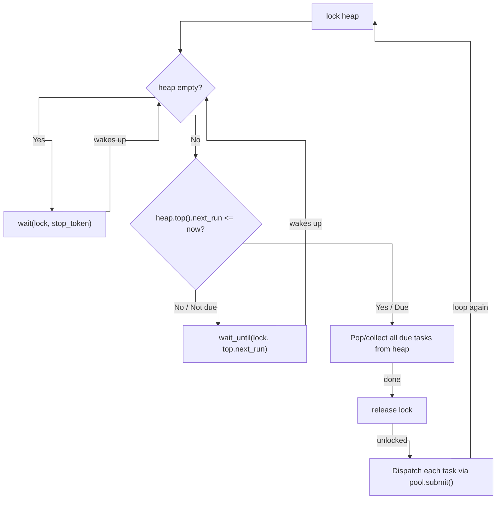

# ADR-0004: Scheduler as a Separate Class

**Status:** Accepted
**Date:** 2025-07

## Context

Metric collectors must be invoked periodically (e.g., CPU every 500 ms, RAM every 1 s). Two options exist:

**Option A - Scheduling built into ThreadPool**
Add `submit_periodic(interval, callback)` directly to `ThreadPool`.

**Option B - Separate `Scheduler` class**
`Scheduler` owns a timing structure and a dedicated thread. It dispatches due tasks to an injected `ThreadPool`.

## Decision

**Option B - Separate `Scheduler` class** with `ThreadPool` injected by reference.

## Rationale

**Single Responsibility:** `ThreadPool` manages worker threads and executes callables. Timing logic is a distinct concern. Mixing them would make `ThreadPool` harder to test and benchmark in isolation.

**Testability:** `Scheduler` can be tested against a real `ThreadPool` independently. `ThreadPool` benchmarks remain unaffected by scheduling complexity.

**Flexibility:** Callers may use `ThreadPool` without scheduling, or compose a different timing strategy on top of the same pool.

## Design

Two separate data structures serve two separate purposes:

- **`ThreadPool`** holds a FIFO `std::deque<Task>` - tasks waiting for a   free worker thread. No timing involved.
- **`Scheduler`** holds a min-heap (`std::priority_queue` with   `std::greater`) of `ScheduledTask` entries keyed on `next_run`   (`std::chrono::steady_clock::time_point`). The heap is ordered by   execution time, not by importance - the earliest due task is always at the top.

When a task becomes due, the scheduler calls `pool.submit(callback)`, moving it from the timing heap into the ThreadPool queue for execution.

```
Scheduler min-heap → (when due) → pool.submit() → ThreadPool FIFO → worker
```

The scheduler loop:



`steady_clock` is used over `system_clock` to avoid timer jumps from NTP or DST changes. The mutex is released before calling `pool_.submit()` to avoid holding two locks simultaneously.

## Consequences

- `Scheduler` holds a non-owning reference to `ThreadPool`. `ThreadPool`   must outlive `Scheduler` - enforced by construction order in `MonitorCore`.
- `cancel()` inserts the `TaskId` into a `std::set` checked at dispatch   time - O(log n), no heap restructuring required.
- Periodic interval is measured from dispatch time, not completion time.   For long-running tasks, callers should use `schedule_once()` with   self-rescheduling.
