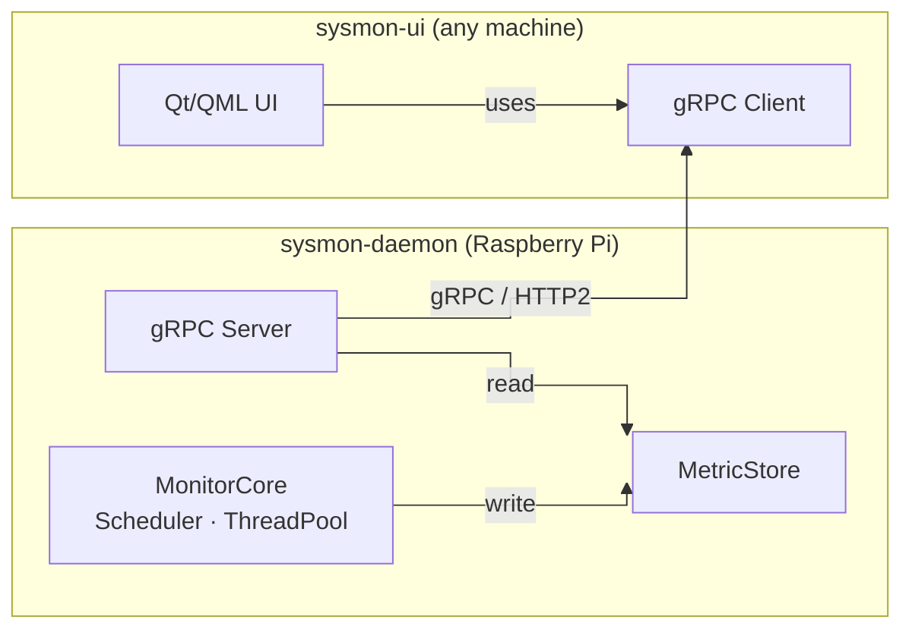
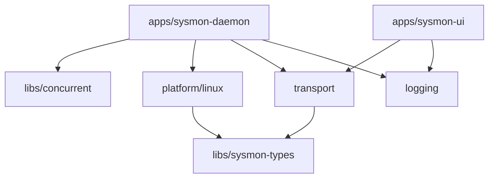
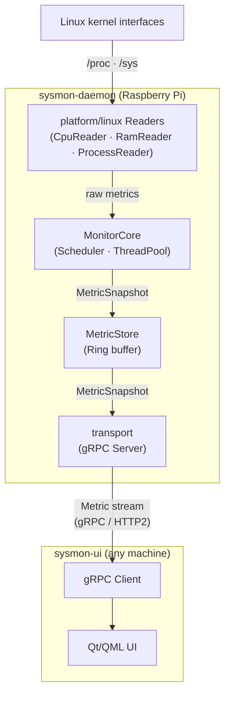

# Architecture

## Goals

- Demonstrate modern C++ software architecture.
- Provide a reusable concurrency library.
- Separate platform-specific code from domain logic.
- Keep dependencies explicit.
- Maximize testability.
- Avoid unnecessary complexity.

## Design Principles

- Separation of Concerns
- Single Responsibility Principle
- Composition over Inheritance
- Platform Abstraction
- Explicit Dependencies
- Reusable Libraries

## Key Design Decisions

See `docs/adr/` for the full rationale behind each decision.

| Decision | Choice | ADR |
|---|---|---|
| Repository structure | Monorepo | [ADR-0001](adr/ADR-0001-monorepo-structure.md) |

## System Architecture

The project produces two independent binaries with a clear network boundary between them:

- **`sysmon-daemon`** - Headless, no Qt dependency, cross-compiled for aarch64 via Yocto. Runs as a systemd service on the Raspberry Pi.
- **`sysmon-ui`** - Desktop Qt/QML application, connects to the daemon over gRPC. Can run on the Raspberry Pi itself or any machine on the network.

This separation gives gRPC a genuine architectural purpose: It is the network boundary between data collection and visualization, not an internal inter process communication mechanism.

This results in the following modules:

| Module | Responsibility |
|---|---|
| libs/concurrent | Reusable thread pool and scheduler. No sysmon dependencies. |
| libs/sysmon-types | Shared data types and interfaces: ICollector, MetricSnapshot. No behaviour, no platform code. |
| platform/linux | Implements the reader interfaces using /proc and /sys. Depends on libs/sysmon-types for MetricSnapshot. |
| transport | gRPC service definition (proto) and MonitoringServiceImpl. Streams monitoring data to clients. Depends on libs/sysmon-types. |
| logging | Structured logger (spdlog wrapper). No internal dependencies. |
| apps/sysmon-daemon | Composition root: creates MonitorCore (owns Scheduler, readers, and MetricStore) and starts the gRPC server. |
| apps/sysmon-ui | Qt/QML application. Uses gRPC client stubs from transport to receive the metric stream from sysmon-daemon. |

## Dependency Graph

Arrows mean "depends on". Dependency direction is strictly top-down without cycles.

## Data Flow

How data moves at runtime.

`MonitorCore` writes snapshots to the `MetricStore`, while the `gRPC Server` reads them.
Both components share the `MetricStore` but remain otherwise independent.
