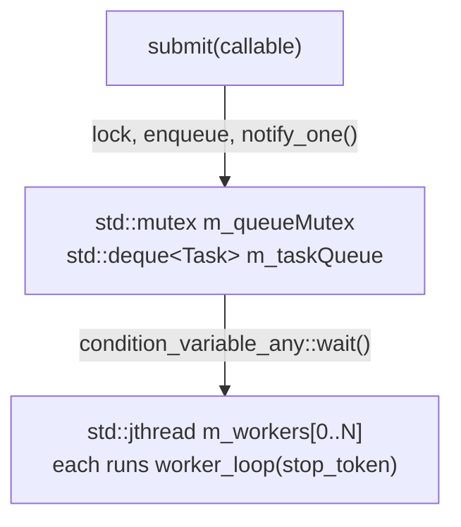
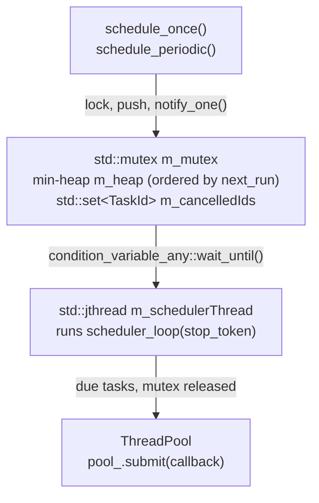

# libs/concurrent - Architecture and Internals

## Overview

`libs/concurrent` provides two components with clearly separated responsibilities:

| Component | Responsibility |
|---|---|
| `ThreadPool` | Manages worker threads and executes submitted callables |
| `Scheduler` | Tracks timing and dispatches due tasks to a `ThreadPool` |

The two components are intentionally decoupled: `ThreadPool` knows nothing about time, and `Scheduler` knows nothing about thread management.

## ThreadPool

### Internal Structure

Each worker blocks on `condition_variable_any::wait()` using the `std::stop_token` overload. A worker wakes on exactly two conditions: a new task in the queue, or a stop request. No other synchronisation primitives are needed.

### Shutdown Sequence

1. `ThreadPool` destructor is called.
2. `std::jthread` destructors fire in reverse declaration order -    `m_workers` is declared last, so it destructs first.
3. Each `jthread` calls `request_stop()` then `join()` on its thread.
4. Each worker wakes from `wait()`, sees `stop_requested() == true` and an empty queue, and returns.
5. `m_queueMutex` and `m_taskQueue` are then safely destroyed.

**Declaration order matters.** `m_workers` must be declared after `m_queueMutex` and `m_taskQueue` in the class so that it destructs first.

### submit() and std::packaged_task

`submit()` wraps the callable in a `std::packaged_task` held by a `std::shared_ptr`. The lambda stored in the queue calls the packaged task; the caller receives the associated `std::future<T>`. Exceptions thrown inside the callable are captured by the packaged task and rethrown on `future.get()`.

The `shared_ptr` is necessary because `std::packaged_task` is not copyable, but the `std::function<void()>` stored in the queue must be. The `shared_ptr` makes the non-copyable task indirectly copyable.

## Scheduler

### Internal Structure

The min-heap is ordered by `next_run` (`steady_clock::time_point`) - the soonest task is always at the top. This is purely a timing mechanism, not a priority system. All tasks are equal in importance.

### Two Queues, Two Purposes

| Structure | Lives in | Ordered by | Purpose |
|---|---|---|---|
| `std::deque<Task> m_taskQueue` | `ThreadPool` | Insertion order (FIFO) | Which worker executes next |
| min-heap `m_heap` | `Scheduler` | Execution time (`next_run`) | When to submit to the pool |

When a task becomes due, the scheduler removes it from the heap and calls `pool_.submit()`, transferring it into the ThreadPool's FIFO queue.

### Mutex Release Before submit()

The scheduler releases `m_mutex` before calling `pool_.submit()`. This is deliberate: holding two locks simultaneously (scheduler `m_mutex` and ThreadPool `m_queueMutex`) would create a potential deadlock if a callback ever called back into the scheduler. Releasing first avoids this class of bug entirely.

### Cancellation

`cancel(id)` inserts the `TaskId` into `m_cancelledIds`. At dispatch time, the scheduler checks this set and skips cancelled tasks. This is O(log n) and avoids restructuring the heap. Cancelled IDs are erased from the set after being checked to prevent unbounded growth.

### Lifetime Rule

`Scheduler` holds a non-owning reference (`ThreadPool&`) to the pool. The `ThreadPool` must outlive the `Scheduler`. In `MonitorCore`, the `ThreadPool` is declared before the `Scheduler` - member destructors run in reverse declaration order, so the `Scheduler` is always destroyed first.

## Thread Safety Summary

| Method | Thread-safe |
|---|---|
| `ThreadPool::submit()` | ✓ |
| `ThreadPool::pendingTasks()` | ✓ (approximate) |
| `Scheduler::scheduleOnce()` | ✓ |
| `Scheduler::schedulePeriodic()` | ✓ |
| `Scheduler::cancel()` | ✓ |
